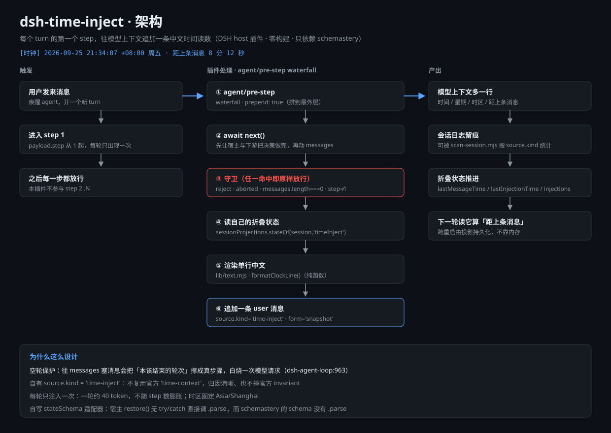

# dsh-time-inject



> ⚠️ **非官方插件** —— 社区作品，与 DeepSeek 官方无关。官方同类包是 `@deepseek-ai/dsh-time-context`，
> 本插件是它的**中文单行**变体（差异见下）。
>
> ⚠️ **Unofficial plugin** — a community project, unaffiliated with DeepSeek. The official package doing this job is `@deepseek-ai/dsh-time-context`; this plugin is its **single-line Chinese** variant (differences below).

给 [DSH（DeepSeek Harness）](https://github.com/deepseek-ai/deepseek-harness) 的 host 插件：
**每个 turn 的第一个 step** 往模型上下文里追加一条**单行中文时间读数**，
让 agent 永远知道「现在几点、距上一条消息过了多久」。

**English:** A host plugin for [DSH (DeepSeek Harness)](https://github.com/deepseek-ai/deepseek-harness): on the **first step of every turn** it appends a **single-line Chinese clock reading** to the model context, so the agent always knows what time it is and how long ago the previous message arrived.

文案样例（就是模型实际看到的那一行，一字不多）：
**Sample output** (exactly the single line the model actually sees, nothing more):

```
[时钟] 2026-09-25 21:34:07 +08:00 周五 · 距上条消息 8 分 12 秒
[时钟] 2026-09-25 21:34:07 +08:00 周五 · 距上条消息 刚刚
[时钟] 2026-09-26 00:00:03 +08:00 周六 · 距上次读数 1 小时 3 分
[时钟] 2026-09-25 21:34:07 +08:00 周五 · 距上条消息 未知
```

- `刚刚`：距上条消息不足 1 秒（**时钟回退也钳到这里**，elapsed 永不为负）
  **English:** `刚刚` ("just now"): less than 1 second since the previous message (**clock rollback is clamped here too**, so elapsed is never negative).
- `距上次读数`：本会话内还没有「上一条模型可见消息」时，退化到本插件上一次注入
  **English:** `距上次读数` ("since the last reading"): when the session has no "previous model-visible message" yet, it degrades to this plugin's own last injection.
- `未知`：连上次读数都没有（会话刚开、或投影服务不可用）
  **English:** `未知` ("unknown"): there is not even a previous reading (brand-new session, or the projection service is unavailable).
- 时长最多保留**两个**单位：`8 分 12 秒` / `1 小时 3 分` / `1 天 2 小时` / `59 秒`
  **English:** A duration keeps at most **two** units: `8 分 12 秒` / `1 小时 3 分` / `1 天 2 小时` / `59 秒`.

## 它怎么工作 / How It Works

```
agent/pre-step (waterfall, prepend: true)
      │
      ├─ await next()                       ← 先让下游/宿主把所有决策做完
      ├─ decision.kind !== 'enter'      → 原样放行
      ├─ signal.aborted                 → 原样放行
      ├─ messages.length === 0          → 🩸 原样放行（空轮保护，见下）
      ├─ step !== 1                     → 原样放行（一个 turn 只注入一次）
      ├─ 读自己的 sessionProjections('timeInject') 折叠状态
      └─ 返回 { ...decision, messages: [...messages, 那条读数] }

sessionProjections 折叠（key = timeInject, stateVersion = 1）
      lastMessageTime    = 最近一条**模型可见且非本插件注入**的事件时间
      lastInjectionTime  = 本插件最近一次注入时间
      injections         = 本插件注入条数
```

**English:** What the diagram says, line by line — it hangs off `agent/pre-step` as a `prepend: true` waterfall hook; it first `await next()` so that downstream/host code has finished all its decisions; then it passes the decision through untouched when `decision.kind !== 'enter'`, when `signal.aborted`, when `messages.length === 0` (🩸 empty-turn guard, see below), or when `step !== 1` (only one injection per turn); otherwise it reads its own `sessionProjections('timeInject')` folded state and returns `{ ...decision, messages: [...messages, that reading] }`. The folded state (`key = timeInject`, `stateVersion = 1`) holds: `lastMessageTime` = the time of the most recent event that is **model-visible and not injected by this plugin**; `lastInjectionTime` = this plugin's latest injection time; `injections` = the number of injections this plugin has made.

### 🩸 空轮保护（本插件最重要的一条）/ 🩸 Empty-Turn Guard (the single most important rule in this plugin)

`dsh-agent-loop` 的 `lib/index.js:963` 用 `decision.messages.length === 0` 判「本轮没有内容 ⇒ 正常收尾」。
**往 `messages` 里塞任何一条消息，都会把本该结束的轮次变成一个真步骤 ⇒ 白烧一次模型请求。**
所以 `decision.messages.length === 0` 时本插件**原样返回 decision**（`lib/index.mjs:241`）。

**English:** `dsh-agent-loop`'s `lib/index.js:963` uses `decision.messages.length === 0` to decide "this turn has no content ⇒ wrap up normally". **Pushing any message into `messages` turns a turn that should have ended into a real step ⇒ one model request burned for nothing.** So when `decision.messages.length === 0`, this plugin **returns the decision untouched** (`lib/index.mjs:241`).

### 与官方 `@deepseek-ai/dsh-time-context` 的差异 / Differences from the Official `@deepseek-ai/dsh-time-context`

| 维度 | 官方 | 本插件 |
|---|---|---|
| 文案 | 英文三行 | 中文单行紧凑 |
| 触发 | 每步 + `refreshIntervalMs` 节流（默认 10 min） | **只在 `step === 1`**（官方那套节流逻辑整体不要） |
| 时区 | 从 `user-rpc.clientTimeZone` 派生三态 | 固定 `Asia/Shanghai`（可配） |
| `source.kind` | `'time-context'` | `'time-inject'`（**绝不复用官方标识**） |
| invariant companion | 可选提供 | **不提供** |
| 折叠里的自己 | 注入消息也算进 `lastMessageTime` | 排除自己，`距上条消息` 量的确实是别人的消息 |

**English:**

| Dimension | Official | This plugin |
|---|---|---|
| Text | three lines of English | one compact line of Chinese |
| Trigger | every step + `refreshIntervalMs` throttling (default 10 min) | **only when `step === 1`** (the whole throttling scheme is deliberately dropped) |
| Time zone | three states derived from `user-rpc.clientTimeZone` | fixed `Asia/Shanghai` (configurable) |
| `source.kind` | `'time-context'` | `'time-inject'` (**never reuses the official identifier**) |
| invariant companion | optionally provided | **not provided** |
| Self in the fold | injected messages also count towards `lastMessageTime` | self is excluded, so `距上条消息` really does measure someone else's message |

## 装法 / Installation

**路线 A（推荐·改动面最小）——profile 的 `cordis.patch.yml` 里加一条 `insert`**
**Route A (recommended · smallest footprint) — add one `insert` entry to the profile's `cordis.patch.yml`**

1. 把本仓源码拷进 profile 的 `vendor/`，并 `link:` 进 profile：
   **English:** Copy this repo's source into the profile's `vendor/` and `link:` it into the profile:

   ```jsonc
   // ~/.dsh/profiles/web/package.json
   "dependencies": { "dsh-time-inject": "link:vendor/dsh-time-inject-src" }
   ```

2. 在 `~/.dsh/profiles/web/cordis.patch.yml` 追加：
   **English:** Append to `~/.dsh/profiles/web/cordis.patch.yml`:

   ```yaml
   - insert:
       - id: time-inject
         name: 'dsh-time-inject'
   ```

3. 在 profile 目录跑一次 `pnpm install`（`link:` 依赖需要它建 junction），然后重启 `dsh web`。
   **English:** Run `pnpm install` once in the profile directory (`link:` dependencies need it to create the junction), then restart `dsh web`.

   > 💡 如果你想**跳过 `pnpm install`**（例如你的 profile 里也有 `file:vendor/*.tgz` 型依赖，
   > 而 install 会重新解包它们），可以手动建 Junction：
   > `mklink /J ~/.dsh/profiles/web/node_modules/dsh-time-inject <源码目录>`（Windows），
   > 效果与 `link:` 相同，且不改动任何锁文件。本仓的 `tools/install.mjs` 就是这条路线。
   >
   > 💡 **English:** If you want to **skip `pnpm install`** (for example your profile also has `file:vendor/*.tgz` dependencies and install would re-unpack them), you can create the Junction by hand:
   > `mklink /J ~/.dsh/profiles/web/node_modules/dsh-time-inject <source dir>` (Windows).
   > The effect is identical to `link:`, and no lockfile is touched. This repo's `tools/install.mjs` takes exactly this route.

**路线 B（当 bundle 包挂）——进 `bundles` 列表**
**Route B (mount it as a bundle) — add it to the `bundles` list**

1. 同 A 的 `link:` 依赖；
   **English:** Same `link:` dependency as route A;
2. `~/.dsh/profiles/web/package.json` 的 `dsh.profile.bundles` 里加 `"dsh-time-inject"`
   （本包的 `dsh.bundle.patch` 会让它自己的 `cordis.patch.yml` 被当成一层 patch）；
   **English:** add `"dsh-time-inject"` to `dsh.profile.bundles` in `~/.dsh/profiles/web/package.json` (this package's `dsh.bundle.patch` makes its own `cordis.patch.yml` count as one patch layer);
3. `pnpm install` + 重启 `dsh web`。
   **English:** `pnpm install` + restart `dsh web`.

> ⚠️ 别想用 patch 的 `name` 字段「把官方那行换成我们」：`name` 是**断言**不是改名，
> 不匹配就整条 `warn + skip`（静默失效）。官方那行 `id: time-context` 本来就
> `disabled: true`，保持关闭、另起一条 `insert` 即可。
>
> ⚠️ **English:** Don't try to swap the official line for ours via the patch `name` field: `name` is an **assertion**, not a rename — on a mismatch the whole entry does `warn + skip` (a silent no-op). The official line `id: time-context` is already `disabled: true`, so leave it off and add a separate `insert`.

### 自带的安装 / 回滚脚本（默认干跑）/ Bundled Install & Rollback Scripts (dry-run by default)

`tools/install.mjs` 自动做上面的路线 A，四步全部可回滚：
**① 先备份 profile 的 `cordis.patch.yml`** → ② 把源码铺到 `vendor/` → ③ 在 profile 的 `node_modules/` 建 Junction → ④ 在 patch 末尾追加一行 `insert`。
`tools/uninstall.mjs` 负责回滚：只删 Junction（源码与备份保留）；加 `--backup <备份目录>` 才额外从备份还原 `cordis.patch.yml`。
两个脚本**默认都是干跑**，只有加 `--apply` 才真的动手。

```powershell
node tools/install.mjs                                 # 干跑：只打印将要做的事 + 现状检查
node tools/install.mjs --apply                         # 真装（第 ① 步先备份 cordis.patch.yml）
node tools/install.mjs --apply --backups <备份根目录>    # 真装 + 自定义备份根目录（默认 ~/.dsh-plugin-backups）
node tools/uninstall.mjs                               # 干跑：只打印将要做的事
node tools/uninstall.mjs --apply                       # 回滚：删 Junction（源码、备份都保留）
node tools/uninstall.mjs --apply --backup <备份目录>     # 回滚：删 Junction + 从该备份目录还原 cordis.patch.yml
```

**English:** `tools/install.mjs` automates route A above; all four steps are reversible: **① back up the profile's `cordis.patch.yml` first** → ② lay the source down into `vendor/` → ③ create the Junction under the profile's `node_modules/` → ④ append the `insert` line to the patch. `tools/uninstall.mjs` rolls it back: it removes only the Junction (source and backups are kept); add `--backup <backup dir>` to also restore `cordis.patch.yml` from a backup. **Both scripts are dry-run by default** — they only act when `--apply` is passed.

```powershell
node tools/install.mjs                                 # dry run: print what it would do + current-state checks
node tools/install.mjs --apply                         # actually install (step ① backs up cordis.patch.yml first)
node tools/install.mjs --apply --backups <backup root>  # actually install with a custom backup root (default ~/.dsh-plugin-backups)
node tools/uninstall.mjs                               # dry run: print what it would do
node tools/uninstall.mjs --apply                       # roll back: remove the Junction (source and backups kept)
node tools/uninstall.mjs --apply --backup <backup dir>  # roll back: remove the Junction + restore the patch from that backup
```

> ℹ️ **分发范围 / Distribution:** 上面的 `tools/`（以及 `test/`、`docs/`）**不在 npm 包的分发清单**里 —— `package.json` 的 `files` 只列 `lib` + `cordis.patch.yml` + `README.md`，运行时代码全部在 `lib/`。要用这两支脚本，请**直接从 GitHub 仓库取**（`git clone` 或网页下载对应文件）。
>
> **English:** The `tools/` directory above (along with `test/` and `docs/`) is **not part of the npm package**: the `files` field lists only `lib` + `cordis.patch.yml` + `README.md`, and all runtime code lives in `lib/`. To use these two scripts, **take them straight from the GitHub repository** (`git clone`, or download the files from the web).

## 配置项 / Configuration

| 字段 | 类型 | 默认 | 说明 |
|---|---|---|---|
| `enabled` | boolean | `true` | 总开关 |
| `timeZone` | string | `'Asia/Shanghai'` | 显示时区（IANA 名）。填非法名不会炸，会降级回默认时区 |
| `includeSubagents` | boolean | `true` | 子代理的轮次是否也注入 |

**English:**

| Field | Type | Default | Description |
|---|---|---|---|
| `enabled` | boolean | `true` | master switch |
| `timeZone` | string | `'Asia/Shanghai'` | display time zone (IANA name). An invalid name will not crash it, it degrades to the default zone |
| `includeSubagents` | boolean | `true` | whether subagent turns are injected as well |

改配置 = 改 profile patch 里那一行的 `config`（整字段替换，不是深合并），或由 cordis 重载插件触发重新 `apply`。
例：
**English:** Changing the configuration means editing `config` on that one line in the profile patch (whole-field replacement, not a deep merge), or letting cordis reload the plugin to trigger a fresh `apply`.
Example:

```yaml
- id: time-inject
  config:
    timeZone: 'Asia/Shanghai'
    includeSubagents: false
```

## 回滚（三步，任选其一即可停掉注入）/ Rollback (any one of three steps stops the injection)

1. **最快**：把 patch 里那条 `insert` 改成 `disabled: true`（或直接删掉那条 insert），重载/重启；
   **English:** **Fastest:** change that `insert` entry in the patch to `disabled: true` (or just delete the insert), then reload/restart;
2. 从 `dsh.profile.bundles` / `dependencies` 里移除 `dsh-time-inject`，`pnpm install`，重启；
   **English:** remove `dsh-time-inject` from `dsh.profile.bundles` / `dependencies`, run `pnpm install`, restart;
3. 想在**不碰配置**的前提下临时关：把 `config.enabled` 设为 `false`。
   **English:** to switch it off temporarily **without touching the mount configuration**: set `config.enabled` to `false`.

用本仓脚本回滚（**默认干跑**）：
**English:** Rolling back with this repo's script (**dry-run by default**):

```powershell
node tools/uninstall.mjs --apply --backup <备份目录>   # 删 Junction + 从该备份目录还原 cordis.patch.yml
```

（不加 `--backup` 只删 Junction、patch 里的 `insert` 行保留；脚本说明见「装法 / Installation」一节。）
**English:** (without `--backup` it only removes the Junction and leaves the patch's `insert` line in place; the script is described under *Installation*.)

> 回滚**不需要**清任何数据：投影只是 `sessionProjections` 的一格折叠状态，
> 键消失后宿主读作「能力缺失」，不会留下垃圾；已注入的历史消息本来就在会话日志里，
> 那是只读事实、也不影响后续（本插件关掉后不再产生新的 `source.kind === 'time-inject'` 消息）。
>
> **English:** Rollback **does not** require cleaning up any data: the projection is just one cell of folded state in `sessionProjections`; once the key is gone the host reads it as "capability missing" and no garbage is left behind. Messages that were already injected sit in the session log anyway — that is a read-only fact and it does not affect anything later (with the plugin off, no new `source.kind === 'time-inject'` messages are produced).

## 自测 / Self-Test

```powershell
node test/selftest.mjs     # 纯函数 + 源码断言，零依赖（npm test）
node test/harness.mjs      # 宿主桩：真跑 apply() 与 handler
```

- `test/selftest.mjs`：118 项，覆盖文案格式 / 中文星期 / 时长边界（0 秒·59 秒·59 分·跨天·跨月·跨年·闰日）/
  时钟回退钳 0 / UTC 偏移 / 非法输入不抛错，外加 `lib/index.mjs` 的 🩸 硬要求静态断言。
  **English:** `test/selftest.mjs`: 118 cases, covering text format / Chinese weekday names / duration boundaries (0 s · 59 s · 59 min · across days · across months · across years · leap day) / clock rollback clamped to 0 / UTC offset / invalid input not throwing, plus static assertions for the 🩸 hard requirements in `lib/index.mjs`.
- `test/harness.mjs`：81 项，用 `module.registerHooks` 把 `schemastery` / `@deepseek-ai/dsh-llm`
  换成内存桩，**真的 import 并调用** `apply()`，用假 ctx / 假 payload 验空轮保护、
  注入消息形状（`source` 恰好 3 个 key、`section.text === content[0].text`）、
  `step` 触发时机、异常语义、投影折叠与配置兜底。
  **English:** `test/harness.mjs`: 81 cases. It uses `module.registerHooks` to replace `schemastery` / `@deepseek-ai/dsh-llm` with in-memory stubs, **really imports and calls** `apply()`, and with a fake ctx / fake payload it verifies the empty-turn guard, the injected message shape (`source` has exactly 3 keys, `section.text === content[0].text`), the `step` trigger timing, exception semantics, projection folding and configuration fallbacks.

## 文件 / Files

| 文件 | 职责 |
|---|---|
| `lib/text.mjs` | 中文文案纯函数（时间戳 / 星期 / 时长 / 偏移），**零宿主依赖** |
| `lib/index.mjs` | 插件入口：`name` / `inject` / `Config` / `apply`，注册投影 + `agent/pre-step` |
| `cordis.patch.yml` | bundle patch：一条 `insert` 把插件行挂进 loader 树 |
| `test/selftest.mjs` | 纯函数自测（进 `npm test`） |
| `test/harness.mjs` | 宿主桩 harness（不进 `npm test`，它依赖 `module.registerHooks`） |
| `tools/install.mjs` | 装机辅助：先备份 profile patch + 铺源码 + 建 Junction + 追加 patch 行（**默认干跑**、幂等、只增不删） |
| `tools/uninstall.mjs` | 回滚辅助（默认干跑；只删 Junction，源码与备份保留；加 `--backup <备份目录>` 才还原 patch） |
| `tools/scan-session.mjs` | 诊断：读多帧 zstd 会话日志，统计事件类型与注入来源（`source.kind` 分布） |

**English:**

| File | Responsibility |
|---|---|
| `lib/text.mjs` | pure functions for the Chinese text (timestamp / weekday / duration / offset), **zero host dependencies** |
| `lib/index.mjs` | plugin entry: `name` / `inject` / `Config` / `apply`; registers the projection + `agent/pre-step` |
| `cordis.patch.yml` | bundle patch: a single `insert` hooks the plugin line into the loader tree |
| `test/selftest.mjs` | pure-function self-test (part of `npm test`) |
| `test/harness.mjs` | host-stub harness (not part of `npm test`; it depends on `module.registerHooks`) |
| `tools/install.mjs` | install helper: back up the profile patch first + lay down the source + create the Junction + append the patch line (**dry-run by default**, idempotent, add-only) |
| `tools/uninstall.mjs` | rollback helper (dry-run by default; removes only the Junction, source and backups are kept; add `--backup <backup dir>` to also restore the patch) |
| `tools/scan-session.mjs` | diagnostics: read multi-frame zstd session logs and tally event types and injection sources (`source.kind` distribution) |

## 运行环境 / Requirements

- **DSH（DeepSeek Harness）≥ `0.1.7-rc.2`** —— `package.json` 里 `dsh.compatibility.dshReleases` 声明为 `compatible`；本仓在该版本上实测通过。
- **Node.js ≥ 20** —— `package.json` 的 `engines.node`；本机在 **Node 24** 上实测通过。
- **运行依赖：无**。代码用到 `schemastery`，但它**由 DSH 宿主提供**（见 `peerDependencies`），本仓不随包安装任何第三方运行依赖。

**English:**
- **DSH (DeepSeek Harness) ≥ `0.1.7-rc.2`** — declared `compatible` in `package.json`'s `dsh.compatibility.dshReleases`; verified on that release.
- **Node.js ≥ 20** — see `engines.node` in `package.json`; verified on **Node 24** here.
- **Runtime dependencies: none**. The code uses `schemastery`, but it is **provided by the DSH host** (see `peerDependencies`); this package installs no third-party runtime dependency.

## 权限与依赖 / Permissions & Dependencies

- **文件 / Files**：插件运行时只读宿主给的会话事件与投影状态，自己不直接读写文件。`tools/install.mjs --apply` 会写 profile 的 `vendor/dsh-time-inject-src/`、在 profile 的 `node_modules/` 建一个 Junction、并追加 profile 的 `cordis.patch.yml`（第 ① 步先把该文件备份到 `~/.dsh-plugin-backups/<时间戳>/`）；`tools/uninstall.mjs --apply` 只删那个 Junction，加 `--backup <目录>` 才还原 `cordis.patch.yml`（还原前把当前文件另存 `.before-restore`）。两个脚本**不带 `--apply` 时不写任何文件**。
- **网络 / Network**：**未发现**任何网络访问 —— 插件与脚本都不发起请求（无 HTTP 客户端、无遥测）。
- **命令 / Commands**：不调用外部命令，不需要管理员 / root（Windows 上建 Junction 也无需提权）。
- **凭据 / Credentials**：**未发现**读取或写入任何凭据（无 token、无密钥、无账号配置）。
- **生命周期脚本 / Lifecycle scripts**：**无** —— `package.json` 里没有 `preinstall` / `install` / `postinstall` 等钩子。
- **运行时依赖 / Runtime dependencies**：`schemastery` 声明为 `peerDependencies`（由 DSH profile 提供，本包不自带）；宿主侧 `@deepseek-ai/dsh-llm` 由 DSH 提供。自测不依赖任何外部包。
- **已知风险 / Known risks**：`tools/uninstall.mjs --apply` 会**删除** profile 里指向本插件源码目录的 Junction（删除前已在代码里就地断言目标必须落在 profile 的 `node_modules/` 之下、且不等于根自身）；`tools/install.mjs --apply` 会**覆盖** `vendor/dsh-time-inject-src/` 里的旧源码（原 patch 已先备份）。

**English:**

- **Files:** at runtime the plugin only reads the session events and projection state the host hands it; it does not read or write files itself. `tools/install.mjs --apply` writes the profile's `vendor/dsh-time-inject-src/`, creates one Junction under the profile's `node_modules/`, and appends to the profile's `cordis.patch.yml` (step ① backs that file up to `~/.dsh-plugin-backups/<timestamp>/` first); `tools/uninstall.mjs --apply` removes only that Junction, and only with `--backup <dir>` restores `cordis.patch.yml` (saving the current file as `.before-restore` first). **Without `--apply` neither script writes anything at all.**
- **Network:** **no** network access found — neither the plugin nor the scripts issue requests (no HTTP client, no telemetry).
- **Commands:** no external commands are invoked and no administrator/root is needed (creating a Junction on Windows needs no elevation either).
- **Credentials:** **none found** being read or written (no tokens, keys or account configuration).
- **Lifecycle scripts:** **none** — `package.json` defines no `preinstall` / `install` / `postinstall` hooks.
- **Runtime dependencies:** `schemastery` is declared under `peerDependencies` (provided by the DSH profile, not bundled here); the host-side `@deepseek-ai/dsh-llm` is provided by DSH. The self-tests need no external packages.
- **Known risks:** `tools/uninstall.mjs --apply` **deletes** the Junction in the profile that points at this plugin's source directory (before deleting, the code asserts in place that the target lies under the profile's `node_modules/` and is not the root itself); `tools/install.mjs --apply` **overwrites** old sources in `vendor/dsh-time-inject-src/` (the original patch has already been backed up).

## 许可 / License

[MIT](LICENSE) © 2026 CNyaotian
